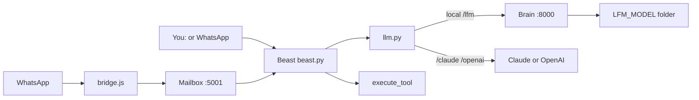
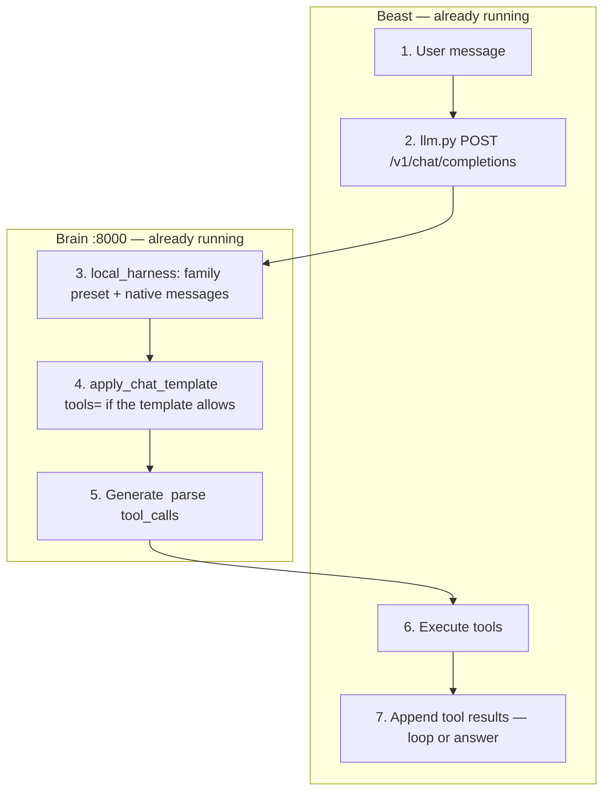

# Agents Monorepo — Local LLM Servers + Obedient Beast

**Author:** Jonathan M Rothberg

There are **four pieces**. Only one of them is a chat window.

| Piece | File in this repo | Terminal title | What it is |
|-------|-------------------|----------------|------------|
| **Brain** | `lfm_thinking.py` | LFM Thinking | Loads **`LFM_MODEL`** (today Qwen3.8-27B-class) on port **8000**. Wait until it says the API is ready. **Do not type chat here.** |
| **Mailbox** | `obedient_beast/server.py` | Beast Server | WhatsApp texts land on port **5001**, then this process asks the brain. |
| **Phone link** | `obedient_beast/whatsapp/bridge.js` | WhatsApp Bridge | Connects your phone. Scan a QR only if it appears. |
| **Local client** | `obedient_beast/beast.py` | Local client — You: | **This is where you type.** Prompt is `You:`. Same Beast as WhatsApp (tools, memory, `/lfm` `/claude` `/openai`). |

WhatsApp does **not** use the local-client window. The local client does **not** use the mailbox or the bridge. Both need the brain.

`test_client.py` (repo root) is a raw ping of `:8000` with **no** Beast tools. It is not the local client.

**No new program to run.** `local_harness.py` is a library (parse tools, chat template, family presets). The brain and Beast import it. Same windows, same `start.sh`. Restart those processes after a code change so they pick it up.

---

## Architecture

Same four processes as before. The harness sits *inside* the brain and Beast — it is not a fifth window.



**Brain** = `lfm_thinking.py` on this Mac, or `linux_thinking.py` on Linux. One of those, not both. `start.sh` picks for you.

### One local turn (what changed)

Before, the brain squashed history into a short `User:` / `Assistant:` transcript and told the model to summarize after every tool. Now the real chat (roles + tool results) goes into the model's own template. Flattening is only a fallback if that template is missing.



`local_harness.py` is also where tool JSON is parsed and where folder-name presets live (Qwen3.8 / Qwen / Gemma / GLM / default). Change weights with `LFM_MODEL`, not by starting a different program.

Optional check (not a daily command): `python test_client.py --eval-parse` (no server) or `--eval` (needs the brain up).

---

## Commands (from `/Users/jonathanrothberg/Agents`)

First time only: `./obedient_beast/setup.sh`

| You want | Run | What opens |
|----------|-----|------------|
| Phone working on this Mac | `./obedient_beast/start.sh phone` | **3 windows:** brain, mailbox, WhatsApp. **No local client.** |
| Type in Terminal **and** the 3 are already up | `./obedient_beast/start.sh you` | **1 window:** `beast.py` only. Will not start a second brain. |
| Type in Terminal, no WhatsApp | `./obedient_beast/start.sh cli` | Brain + local client. |
| Stop them | `./obedient_beast/start.sh stop` | Kills brain, mailbox, WhatsApp, local client, heartbeat. |

Typical night: `start.sh phone`, wait for the brain, then `start.sh you`, then type at `You:` **or** text WhatsApp.

`phone` / `you` force `LFM_URL=http://localhost:8000` and `MCP_ENABLED=false` so this Mac is used and MCP does not hang.

Also: `./start.sh status` · `stop` · `pm2` · `lfm` · `server` · `whatsapp` · `heartbeat` · `clear-history`.

Leave those windows open. Do not text or type until the brain says it is ready.

---

## Repo layout (where the local client lives)

```
Agents/
├── README.md                      ← you are here
├── CLAUDE.md                      ← orientation for LLMs editing this repo
├── lfm_thinking.py                ← BRAIN (macOS/MLX, not a chat window)
├── linux_thinking.py              ← Linux brain (transformers; same :8000 API)
├── local_harness.py               ← shared parse / chat-template / family presets
├── test_client.py                 ← raw :8000 ping + `--eval` / `--eval-parse`
├── flux_art.py                    ← macOS generate_art
├── zimage_art_linux.py            ← Linux generate_art
├── .env.example
└── obedient_beast/
    ├── beast.py                   ← LOCAL CLIENT  (python beast.py → You:)
    ├── llm.py                     ← Claude / OpenAI / local brain
    ├── capabilities.py            ← depth + tool groups
    ├── server.py                  ← mailbox (:5001)
    ├── heartbeat.py               ← task queue
    ├── mcp_client.py / skills_loader.py / browser_tools.py
    ├── whatsapp/bridge.js         ← phone link
    ├── start.sh                   ← phone | you | cli | pm2 | stop | status
    └── workspace/SOUL.md          ← system prompt (plus AGENTS.md, skills/)
```

---

Two projects: local model servers, and Obedient Beast (CLI + WhatsApp). **lfm** means local model (legacy LiquidAI name). Canonical `.env` is **repo root**. Switch brains in a chat with `/lfm`, `/claude`, `/openai`.

Default local weights are **`LFM_MODEL`** (today: `Qwen3.8-27B-mxfp8` under `/Users/jonathanrothberg/MLX_Models/`). Change `LFM_MODEL` when you move to a newer folder — do not hardcode a model name in the agent loop. Missing folder → interactive picker.

`./obedient_beast/start.sh` (no argument) is the five-window stack (brain + mailbox + WhatsApp + heartbeat + CLI). `./obedient_beast/start.sh pm2` backgrounds mailbox/WhatsApp/heartbeat.

`start.sh` launches `lfm_thinking.py` on macOS and `linux_thinking.py` on Linux.

```bash
python lfm_thinking.py --model Qwen3.8-27B-mxfp8 --server   # macOS brain on :8000
python linux_thinking.py --model latest --server            # Linux twin, same API
python test_client.py --eval-parse                          # harness parser tests

# Flash-Next (qwen4_exp 4-bit). Does not change LFM_MODEL / start.sh default.
source /Users/jonathanrothberg/Agents/.venv/bin/activate
python /Users/jonathanrothberg/Agents/lfm_thinking.py --model Qwen3.8-Flash-Next-MLX-4bit --server
```

---

## Beast in brief

`beast.run()` loads history, calls the LLM with tools, executes tool calls (several per turn, sequentially), and repeats up to `DEPTH` (cloud 10, local 8, `/depth N`).

**30 built-in tools** stay in `execute_tool()`. A local 27B is only *offered* a subset by default (`core,browser,art` plus enabled MCP). `/tools all` or `BEAST_TOOL_GROUPS=…` restores everything. Cloud backends get all groups unless you override.

Local thinking knobs are forwarded as `chat_template_kwargs` (ignored by Claude/OpenAI; other local models ignore unknown fields). For Qwen3.8, `QWEN_REASONING_EFFORT` must be `low` / `medium` / `xhigh` (`high` raises in the chat template). Agent default is `medium`.

Slash commands, sessions, MCP, and heartbeat details: [obedient_beast/README.md](obedient_beast/README.md). Markdown runbooks live in `obedient_beast/workspace/skills/<name>/SKILL.md` (`list_skills` / `use_skill`). The `/skills` slash command is the **MCP server catalog**, not those runbooks.

---

## Adding a skill

Drop `obedient_beast/workspace/skills/<name>/SKILL.md`. Beast injects name + description into the prompt; `use_skill` loads the full body. No restart.

---

## Scheduling work with cron

`add_task` supports `scheduled_at`, `repeat_seconds`, and 5-field `cron`. `heartbeat.py` marks one-shot tasks done after it runs them; recurring tasks reschedule.

```
0 9 * * 1-5     # weekday 9am
*/15 * * * *    # every 15 minutes
```

---

## Persistent browser

`browser_*` tools use Playwright with `workspace/browser_profile/`. `pip install playwright && python -m playwright install chromium`. Headless: `BEAST_BROWSER_HEADLESS=true`.

---

## Local FLUX / Z-Image (optional)

macOS Apple Silicon: `flux_art.py` via **mflux** + local FLUX.2-klein weights (`~/FLUX.2-klein-4B-mflux-4bit` or `FLUX_ART_MODEL`). Beast `generate_art` on macOS uses that path. On Linux, Beast `generate_art` uses **`zimage_art_linux.py`** (Z-Image-Turbo + diffusers), not MLX FLUX. Standalone `flux_art_linux.py` is CLI-only.

```bash
pip install mflux
python flux_art.py "a watercolor fox"
# Linux Beast art: pip install -r requirements-zimage-linux.txt
```

---

## Environment variables

Repo-root `.env`. Important knobs:

| Variable | Purpose |
|----------|---------|
| `LLM_BACKEND` | `lfm` (local), `openai`, or `claude` |
| `LLM_FALLBACK` | Optional comma list, e.g. `claude,openai` |
| `LFM_URL` | Local server, default `http://localhost:8000` (no `/v1`) |
| `LFM_URL_REMOTE` | Fallback if localhost is down |
| `LFM_MODEL` | Folder substring for `start.sh` (default `Qwen3.8-27B-mxfp8`) |
| `LFM_MAX_TOKENS` | Local completion cap (default `16384`) |
| `LFM_VERBOSE` | `1` = parse/prompt debug on the local server |
| `QWEN_REASONING_EFFORT` | Qwen3.8 only: `low` / `medium` / `xhigh` (default `medium`) |
| `QWEN_ENABLE_THINKING` / `QWEN_PRESERVE_THINKING` | Forwarded as chat-template kwargs |
| `BEAST_TOOL_GROUPS` | Local default `core,browser,art`; cloud `all` |
| `ANTHROPIC_API_KEY` / `OPENAI_API_KEY` | Cloud only |
| `MCP_ENABLED` | Defaults `false` if unset. Handshake timeout `MCP_RPC_TIMEOUT` (20s) |
| `BRAVE_API_KEY` | Brave Search MCP (not a key in JSON) |
| `ALLOWED_NUMBERS` / `ALLOWED_GROUPS` / `RESPOND_TO_OTHERS` | WhatsApp |
| `BEAST_PORT` | HTTP for the WhatsApp bridge (default 5001) |
| `NOTIFICATION_CHAT_ID` | WhatsApp target for heartbeat notifications |
| `BEAST_BROWSER_HEADLESS` | `true` for Playwright without a window |
| `FLUX_ART_MODEL` | Optional path to FLUX.2-klein weights (macOS `generate_art`) |
| `ZIMAGE_ART_MODEL` / `DIFFUSION_MODELS_DIR` | Linux `generate_art` (Z-Image-Turbo) |

---

## Troubleshooting

- **No `You:` prompt** → the local client is not running. `start.sh phone` does not open it. Run `./obedient_beast/start.sh you`.
- **Local LLM timing out** → `lfm_thinking.py --server` running (Linux: `linux_thinking.py`), `LFM_URL=http://localhost:8000`.
- **CLI hangs at startup** → MCP npx can block. `phone`/`you` force `MCP_ENABLED=false`; otherwise set it in `.env`.
- **`.env` not picked up** → file must be at repo root; Beast loads it even when cwd is `obedient_beast/`.
- **Too few / too many tools** → `/tools` to list, `/tools all` or `/tools core,browser,desktop`.
- **`browser_goto` missing Playwright** → `pip install playwright && python -m playwright install chromium`.
- **Heartbeat tasks stuck pending** → one-shots are marked done in code after the run; confirm `heartbeat.py` is running (`/heartbeat`).
- **FLUX / mlx dylib** → `pip install --upgrade --force-reinstall mlx mlx-metal`.
- **Beast `generate_art` on Linux** → torch + `pip install -r requirements-zimage-linux.txt`; set `ZIMAGE_ART_MODEL` or `DIFFUSION_MODELS_DIR`.

For code orientation (LLMs): [CLAUDE.md](CLAUDE.md). Harness upgrade notes: [obedient_beast/FUTURE_UPGRADES.md](obedient_beast/FUTURE_UPGRADES.md).
